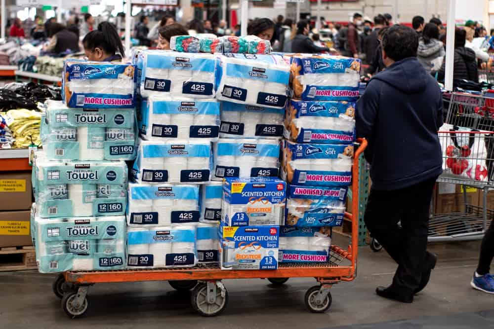

There have been a lot of factors which have made the worsened the transmission of the novel coronavirus. Some of those factors have been due to incorrect judgement and reasoning that we often fall prey to and I wanted to explore some of these aspects. Could the virus have been slowed down if all of us were perfectly rational?

## Exponential Growth

Exponential growth always trips people up. Even though I understand the math behind it, I am always amazed when I see the growth play out. Because the virus infects more than one person (R0 > 1) on average and they in turn infect more than one person, this is a textbook case of exponential growth. The danger was immediately seen by people who understood exponential growth, while it caught everyone else unawares. With exponential growth the numbers are pretty small until they suddenly aren't. This is why it is more important to look at the growth rate than the actual number of cases to get a better idea of the situation.

This is the reason why some people weren't initially worried at all.

> "The virus has killed only 1000 people so far. In a country with 100M people, that's nothing to worry about. Did you know that more people are killed by lightning strikes annual than COVID-19?"

## Tragedy of the Commons

This situation happens when there is a shared resource between individuals and individual acting based on their own self interest leads to depletion of the resource and negatively affects everyone in the long term. This is best explained with an example. Take a village which has a pond with some fish in it. A group of fishermen make their livelihood by selling fish to others. Initially things are okay since the fish reproduce to make up for the fish caught by the fishermen. But what if a malicious fisherman, Mallory, decides that he wants to make a lot more money by catching twice the number of fish that he usually does. And since Alice and Bob see Mallory making more money, they go ahead and do the same as well. In the short term, they all make more money, but the fish end up dying due to this and everyone is unhappy.

This is exactly what happened with masks as well. Some people started hoarding critical supplies like masks (which is a fixed resource at least till the production catches up with demand). This meant that there were acute shortages of masks in hospitals to protect medical personnel and people who were actually sick. In the short term, you are safe-guarding yourself in case you get the virus, but since hoarding masks makes it more probable that at risk people don't get it. This increases the transmission rate and you are increasing the risk of catching the virus yourself.

So, if you have a lot of extra masks, donate it to places where there is a shortage of personal protective equipment. This is the rational thing to do even if you are worried just about yourself.

## Panic buying

There was panic buying everywhere as the situation got worse. This kind of behavior is pretty easy to spread as well. It just takes a few people to start stockpiling and you begin to wonder if there will be any cup noodles left for you, so you start to stockpile as well.

And as you start seeing Facebook posts of empty shelves in supermarkets, you panic. Herd mentality becomes a very strong factor here. If all your friends are doing something and you aren't doing it, you better be sure of what you are doing.

Just to be clear, this is not a good thing to do. Panic buying leads to wasted resources, artificial shortages leading to price gouging and increased prices.

There is another reasons why it is very hard to prevent this completely. Everyone needs to be in agreement that they would not stockpile and only buy what they need, which is very hard. Panic buying has been lesser in countries where there is a lot of trust in the government among the people.

According to researchers, people start panic buying because they feel that they are more in control of the situation. We are living in uncertain times and this is one way to convince yourself that you are doing your part in preparing for the situation ahead.

There are reasonable explanations on why people stockpile essential items like food but there needs to be a new branch of psychology invented to research why people think it is rational to stockpile toilet paper. I mean you are going to die of starvation much earlier before you figure out how to wipe yourself without any toilet paper.

## Out of sight, out of mind

One of the reasons why it is hard to enforce a lowdown is because the "war" this time is with an invisible virus. I am sure we wouldn't need to be cajoled so much if there were an actual war going out there with people dying because of snipers can take out anyone who step out of the house.

People are dying, but probably not right in front of you. Quarter million people are dead but it is very hard to wrap your head around this when there is nothing visibly bad happening around you.

## Delayed gratification

> "The lockdown has not done anything to stop the spread of the virus. We may as well go to work and make sure that the economy doesn't get impacted"

There is also a delayed gratification for all the countermeasures we take. Since it can take 14 to 21 days for the symptoms to manifest, we might still see the number of new cases increase after a lockdown has been imposed. We would need to wait for at least two weeks to know if the scarifies we are making is helping slow down the virus, which can be hard.

## Outcome bias

This brings me to the next point of outcome bias. It is always hard to predict what would have happened if you changed your decision. We cannot predict how many more deaths there would have been if we hadn't extended the lockdown (expect by epidemiologists). We see that the death rate go up anyway and that might incorrectly lead us to the decision that the lockdown wasn't effective and is a waste of our time.

## Misinformation

[One poll](https://docs.cdn.yougov.com/1ghnpqhhpu/econToplines.pdf) done in March 2020 showed that 13% of Americans believed that COVID-19 was a hoax and 49% thought that the virus was man-made! False remedies, conspiracy theories and in-accurate numbers have been causing havoc amid this pandemic. It takes quite a bit of effort to verify facts but we appear knowledgeable when we share an unknown (unverified) fact among our peers.

Creating a message that goes viral in social media platforms has become an art. The messages either trigger at our heart strings or something that we hope is true or something that makes us angry - basically anything which triggers us to share without thinking about the veracity of the link.

I never understood why people spread misinformation, but _I guess some people just want to watch the world burn_.

These are hard times and knowing about how our minds can lead us astray can help us be more conscious in the decisions we take. Stay strong!
