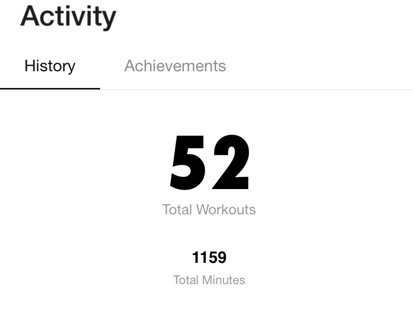

I have considered exercising for a long time now, but it has never moved from the consideration phase to a regular habit until recently. I have been working out consistently for the past two months and just finished my 50th workout! Now that I am reasonably confident that I will stick to this this time around, I have been trying to figure out what changed and if it can help me catch up with my other failed new year resolutions of the last 5 years :p

## Concrete Goals

I had started feeling a bit more bloated than usual thanks to some over zealous eating during my recent US trip. It came as no surprise that my BMI was squarely in the overweight category. This led to me having a concrete goal - to reduce my weight to the normal BMI range.

## Setting goals which motivate you

I find that goals like "I need to exercise more" or "I need to read more books" are not very useful. The _why_ is not clear in these goals. I wanted to feel less fat and have a good BMI and exercising was a natural result from having that goal. The goal was not to exercise, just for the sake of it. Similarly it might be worth exploring why you want to read more or write more and tie that to your goal. Finding the why and looking at the goal from that perspective increases your chances of sticking to a new habit.

## The dopamine hit

Another aspect of setting your goal is that it should be measurable over time. Having a binary goal (like win a nobel prize) is not good because you don't know how far you have left to go. I bought a weighing machine, so tracking my progress over time was easy. Every time, I saw my weight go down even by a few grams, I get a dopamine rush further motivating me. My Apple watch has a lot of features which helped with this as well. I can see trends of my exercise minutes going up, getting more badges, etc. I also started using this app called [Lose it](https://www.loseit.com/) which syncs with my watch and has its own graphs and gamification features - moar dopamine!

## The starting problem

Research has shown that when you are trying to develop a new habit, the initial few days are the hardest. Over time, you don't need to spend as much mental energy to go to the gym - it just becomes second nature to you (which means I am probably spending more energy to get myself to work out than the Rock :p). So you got to force yourself somehow to get past the initial hump. With a global pandemic raging outside and you being alone in your room with nothing much to do apart from work, seems to have helped in this case.

## The social aspect

I have been working out with a few of my friends and it has helped a lot. Unless > 50% of the group is feeling lazy (and that hasn't happened often), we often end up working out on schedule. The shared suffering that you go through during and after the workouts also helps :p This turned out to be a great way to get past the initial hump I was talking about before.

I also share my activity on my Apple watch with a friend who has been consistently doing this for a very long time. You can keep each other motivated by responding to activities. I have to give a shout out the reply suggestions to your friend's workouts - they are hilarious and sarcastic :D I also get (de)motivated whenever I see her finish a 20km hike - some day I hope I get there!

Maybe I should figure out if I can use these techniques to blog more consistently :p
