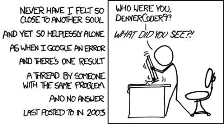
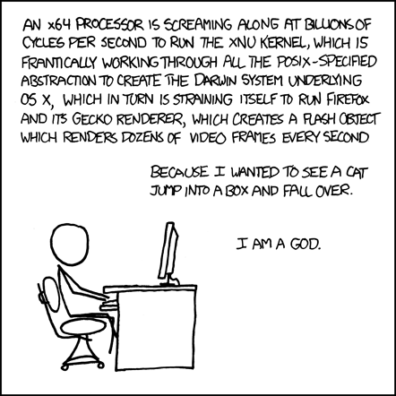
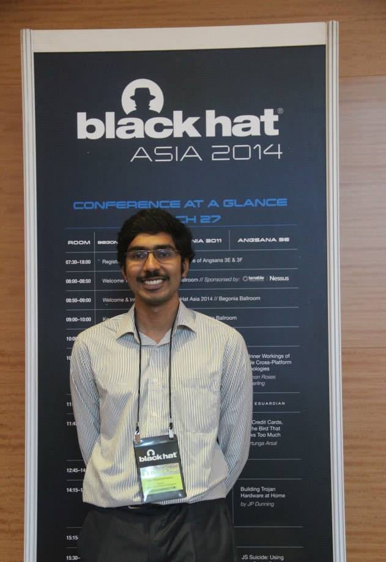

I have been working in the System Security lab during my last year of undergraduation. It was my first foray into research – I had strongly stuck to the software engineering side of things till then. So based on my scant experience, these are the reasons why I think being a researcher rocks B)

The primary reason why I wanted to become a researcher is because it is more challenging. Software engineering is challenging too, albeit in a different way. The projects that I have worked on till now have mostly required me to complete features X, Y and Z within a given time frame. Time was the critical aspect here. Given enough time, I think it would have been easy to complete my previous projects. However when it comes to research projects, time is not as critical. No-one cares if you take years to solve an unsolved problem. I am sure you can hear your boss shouting if plan to apply the logic to your software engineering projects. Again I am talking about the typical software engineering projects that you take up when you are an undergraduate – the complex engineering problems people at Google, Facebook, etc. are solving are interesting for a whole different reason.

A newbie software engineer need not to think out of the box most of the time. Someone out there would have definitely tried to implement what you are trying to build (probably for a different purpose). In fact, at one point, I was convinced that software engineering came down to how well you can Google for stuff :p. Of course, if you are this guy, it is a problem.

Research on the other hand is challenging right from the word go. Even if you are solving a small problem, it is usually something no one has done before. (Read – Bye, Bye Stackoverflow!). Working on something that no one has thought of before – it is a pretty cool feeling!! I find it incredibly sexy to say that I am looking to build a taint tracking system without modifying the browser (which btw has not been attempted before) than saying I am an iOS developer of a company.

In one of the many long conversations with my advisor, he made a passing remark – “After you finish your PhD, you would be the world’s leading expert in your area”. This idea really captivated me! Being the authority in a field – WOW! Sounds pretty amazing right? [This](http://matt.might.net/articles/phd-school-in-pictures) bought me down to earth – but it is still a great ideal to work towards!

Working in research also means you would be pushing the limits – of both technology and your mind. While working as a researcher, I constantly found myself using tools and technologies which were in their early stages ( or non-existent :P ) You would be working at the bleeding edge of technology – it was the browser in my case. I never appreciated it more when Google fixed a bug in their Developer tools or introduced a new time-saving feature! You will also be testing the limits of your mind and body. [The Phd Grind](http://pgbovine.net/PhD-memoir.htm) is an excellent read on how a guy pushes himself constantly during his PhD journey. What does not kill you makes you stronger!

You get to know the inner workings of a particular system like the back of your hand. One of my friends in the lab is looking up on how the rendering engine of a browser paints a single character onto your screen! You would not get to work with systems at such a great depth in your day-to-day developer life. You understand a bit more of the system..the bulb in your head flickers brighter..you feel you are GOD! As always XKCD nails it!

I am GOD!

And of course, you get to travel sometimes to cool conferences (and meet awesome people ) like these :D

So, you feel your life is not exciting enough? Enter the field of research and I can assure you that your life would not be the same again!
